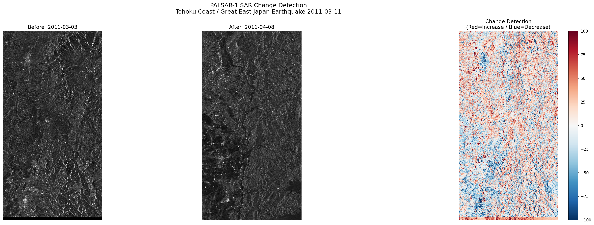

# PALSAR-1 SAR Change Detection Tool
## 東日本大震災前後の地表変化可視化

## 概要
JAXAのPALSAR-1衛星データ（Tellus API経由）を使用し、
2011年東日本大震災前後の東北沿岸における地表変化を可視化するツールです。
衛星SAR（合成開口レーダー）データはQPS研究所が手がける小型SAR衛星と同じ原理を使用しており、
天候・夜間に関わらず地表を観測できる特性を持ちます。

## 成果物
- 震災前後のSAR画像比較（Before/After）
- 後方散乱強度の差分ヒートマップ（Change Detection Map）

## 使用データ
- データソース: Tellus（旧JAXA PALSAR-1）
- 震災前: 2011-03-03（東北沿岸）
- 震災後: 2011-04-08（東北沿岸）
- データセット: PALSAR_L1.1

## 使用技術
- Python 3
- Tellus Traveler API
- matplotlib / Pillow / NumPy
- Google Colab

## 実行方法
1. [Tellus](https://www.tellusxdp.com/)のAPIトークンを取得
2. Google ColabでノートブックをOpen
3. TOKEN変数にAPIトークンを設定して実行

## 技術的課題と学び
- JPEGプレビュー画像は圧縮されているため、ピクセル単位の精度に限界がある
- 2シーン間の撮影軌道・角度の違いにより差分にノイズが発生
- 精度向上には生データ（IMG-HHファイル）と位置合わせ（コレジストレーション）処理が必要
- 今後の改善点として生データを用いた干渉SAR解析を予定

## 背景・目的
QPS研究所が目指す「準リアルタイム地球観測」の社会的価値、
特に災害対応における衛星データの活用可能性を、
実際のデータを使って検証することを目的として作成しました。

## Author
GitHub: Mitsuaki-1004
